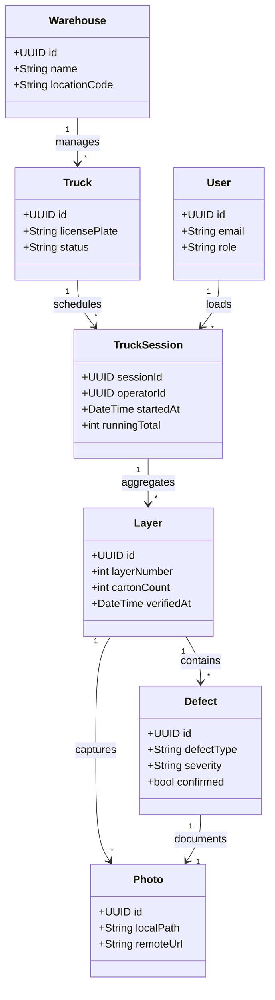

# Entity Relationships & Aggregate Roots - Logistics Vision AI

This document establishes the transaction boundaries, aggregate structures, and relational mappings for the business domain.

---

## 1. Aggregate Roots

To maintain consistency and enforce business invariants, entities are grouped into bounded aggregates:

```
[ TruckSession (Aggregate Root) ]
   |
   +---> [ Layer ]
   |        |
   |        +---> [ Carton ]
   |        +---> [ Photo ]
   |
   +---> [ Defect ]
```

### Aggregate Root: `TruckSession`
*   **Boundary**: Controls the entire loading session transaction.
*   **Rule**: All modifications to `Layers`, `Cartons`, and `Defects` must traverse this aggregate. You cannot add a `Defect` without validating it against the parent `Layer` coordinates and ensuring the `TruckSession` is in a mutable `loading` status.

---

## 2. Mermaid Domain Mapping Diagram


