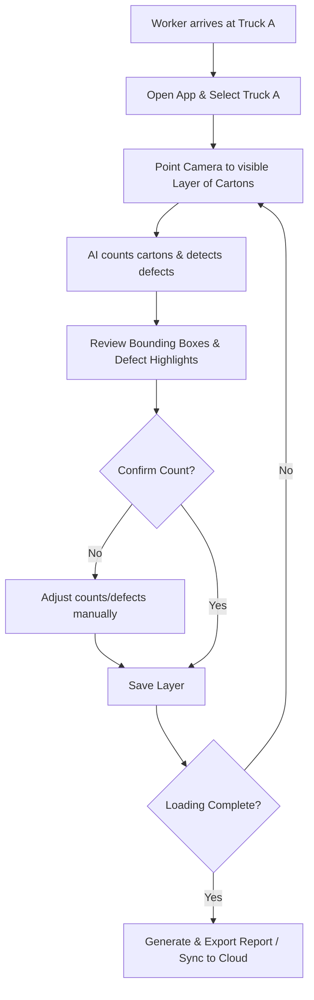

# Product Requirements Document (PRD) - Logistics Vision AI

## 1. Executive Summary & Business Goals
The **Logistics Vision AI** system is a mobile and cloud solution designed to optimize the truck-loading workflow in busy warehouse environments. By automating carton counting and defect detection, the application minimizes manual shipping errors, reduces product damage claims, and increases operational efficiency.

### Business Goals
*   **Reduce Shipping Errors**: Lower the rate of incorrect carton quantities loaded onto delivery trucks by 99.5%.
*   **Accelerate Loading Cycles**: Decrease time spent per truck layer count by at least 60% compared to paper checklist methods.
*   **Establish Accountability**: Digitally record precise carton states (including photo evidence and defect tagging) at loading time to combat false transit damage claims.
*   **Enable Continuous Offline Operations**: Maintain 100% core uptime in deep warehouse sections where internet coverage is non-existent.

---

## 2. User Roles & Personas
*   **Warehouse Operators (Loaders)**
    - *Context*: Working directly inside or at the gate of loading trucks.
    - *Goal*: Fast, reliable scanning of carton layers with minimum touch interaction.
    - *Constraints*: Wear work gloves, carry physical items, operate in varied lighting, need high contrast and large touch targets.
*   **Warehouse Managers / Shift Leads**
    - *Context*: Office-based or walking the floor.
    - *Goal*: Oversee loading progress, verify discrepancies, and export loading reports to client management systems.
*   **System Administrators / DevOps Engineers**
    - *Context*: Remote IT support.
    - *Goal*: Monitor application synchronization status, update AI models over-the-air (OTA), and track device crash logs.

---

## 3. Business Workflow

---

## 4. Functional Requirements

### FR-1: Truck Selection & Session Initialization
*   Operators must be able to select a Truck ID from an offline-cached active truck list or scan a truck barcode/QR code to start a session.
*   The application must query local database stores to resume the loading session if the truck was partially loaded earlier.

### FR-2: AI Camera Carton Counter
*   Provide a custom real-time camera view overlaying bounding boxes for detected cartons.
*   Show a live counter indicating the current layer's carton count.
*   Optimize visual performance to achieve a smooth video preview feed (30 FPS) with low-latency overlays.

### FR-3: Defect Detection & Label Inspection
*   The AI pipeline must evaluate cartons in real-time for defects:
    - *Structural*: Torn, crushed, broken, or open cartons.
    - *Environmental*: Wet cartons.
    - *Operational*: Missing shipping labels.
*   Defected cartons must be highlighted with a distinctive red overlay.
*   Operators can tap any highlighted defect to confirm, override, or add comments/photos.

### FR-4: Layer Saving & Validation
*   Save the current count and metadata as a discrete **Layer Record** containing:
    - `truck_id` (UUID)
    - `layer_number` (Integer, auto-incrementing per truck)
    - `carton_count` (Integer)
    - `timestamp` (UTC ISO-8601)
    - `operator_id` (UUID)
    - `photo_file_path` (Nullable String, path to local storage)
    - `notes` (Nullable Text)
*   The system must calculate and display the running **Truck Total** dynamically:
    $$\text{Truck Total} = \sum_{i=1}^{n} \text{Layer Carton Count}_i$$

### FR-5: Offline First Capabilities
*   All data writes, image captures, and AI counts must execute entirely locally.
*   Local database changes remain on the device. There is no operational-data synchronization queue.

### FR-6: Manager Dashboard & Report Export
*   Export loading reports in CSV, PDF, and JSON formats locally or send via email/SMS.
*   Include operator metadata, aggregated counts, and high-resolution defect images in exported PDF reports.

---

## 5. Non-Functional Requirements

### NFR-1: Performance & Latency
*   **Local Inference Latency**: Offline model inference must run in $\le 150\text{ ms}$ per frame on average modern mobile devices (e.g., iPhone 12 / Android mid-range equivalents).
*   **Database Write Latency**: Database operations must execute in $\le 10\text{ ms}$ to prevent visual stutter.

### NFR-2: Reliability & Data Safety
*   **Data Integrity**: Zero data loss for completed layers. The local SQLite database must use Write-Ahead Logging (WAL) to survive abrupt battery loss.
*   **Offline Capacity**: Support up to 50 truck loading sessions (approx. 5,000 layers and associated photos) cached offline without performance degradation.

### NFR-3: Usability & Human Factors
*   **High-Contrast UI**: High readability under direct sunlight and dark warehouse bays.
*   **Accessibility**: Target buttons must be at least $48 \times 48\text{ dp}$ to support gloved operations.

---

## 6. Edge Cases & Failure Scenarios
*   **EC-1: Extreme Low Light inside Truck Trailers**
    - *Mitigation*: The app must detect low-light scenes and provide a prominent button to toggle the device flashlight without exiting the camera module.
*   **EC-2: Carton Occlusion (Partially hidden cartons)**
    - *Mitigation*: Provide manual override tools on the "Review" screen so operators can manually add or subtract cartons to correct the count.
*   **EC-3: Device Shutdown / Battery Death mid-scan**
    - *Mitigation*: The database must auto-commit transaction entries at the point of saving a layer. The app should resume exactly at the next layer upon rebooting.
*   **EC-4: Out of Local Storage**
    - *Mitigation*: The app must alert the user when storage falls below 500MB and offer to purge oldest synced photos while keeping database log history intact.

---

## 7. Warehouse Constraints & Future Features
*   **Dust & Camera Lens Obstruction**: Add a software-based heuristic that checks image contrast/clarity to warn the operator if the lens appears dirty.
*   **Future AI Retraining**: Collect high-entropy or manually corrected frames (e.g., where the user edited the AI count) to form an active-learning dataset, scheduled to be synced back to cloud servers for retraining the YOLO detection model.
